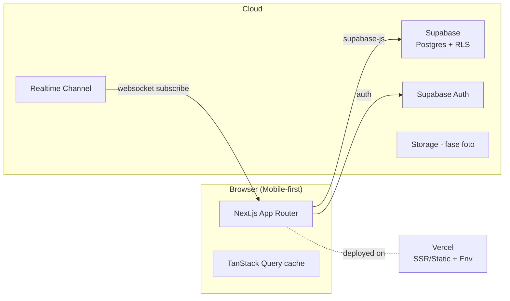
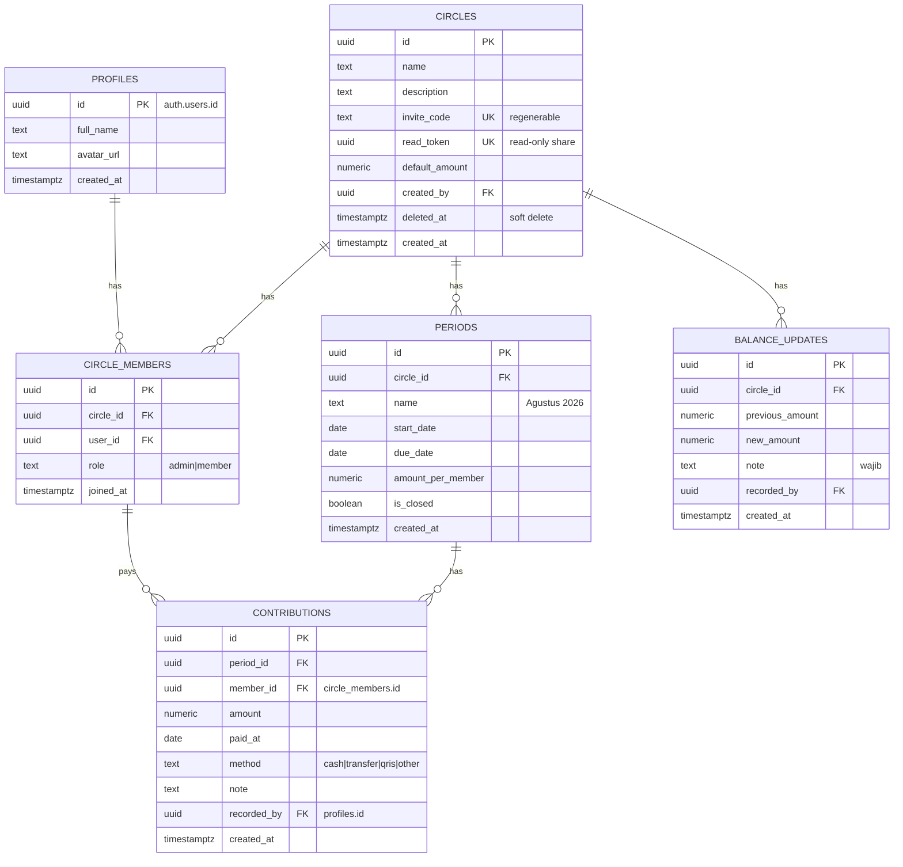

# Architecture — Teadrop

## 1. Tech Stack

| Layer | Teknologi |
|---|---|
| Framework | Next.js 16 (App Router, src dir) + React 19 |
| Bahasa | TypeScript |
| Styling | Tailwind CSS v4 + token desain dark-first (`globals.css`) + primitives (`components/ui.tsx`) |
| Komponen efek | ReactBits SpotlightCard (dikopi manual, tanpa gsap/three) |
| Data fetching | TanStack Query v5 + supabase-js v2 |
| State klien | TanStack Query + React state (tanpa library ekstra) |
| Database/Auth/Realtime | Supabase (Postgres, GoTrue, Realtime) |
| Validasi | Diclient (form sederhana) + RLS + check di RPC |
| PWA | Web App Manifest + service worker (`public/sw.js`) |
| Hosting | Vercel (web) + Supabase cloud (data) |

> **Mode Demo:** ketika `NEXT_PUBLIC_SUPABASE_URL` kosong/placeholder, aplikasi jatuh ke mode
> demo memakai store localStorage (`lib/demo/store.ts`) sehingga seluruh fitur bisa dicoba
> tanpa backend. Semua data layer (`lib/api.ts`) bercabang antara demo & live.

> **Key Env:** `lib/env.ts:supabaseKey()` memprioritaskan `NEXT_PUBLIC_SUPABASE_PUBLISHABLE_KEY`
> (format kunci `sb_publishable_...`) dengan fallback `NEXT_PUBLIC_SUPABASE_ANON_KEY`.

## 2. Diagram Arsitektur



## 3. Entity Relationship Diagram



## 4. Keputusan Desain Penting

| # | Keputusan | Alasan |
|---|---|---|
| D1 | Saldo RDPU/rekening **manual** dengan audit trail immutable | API publik NAB tidak resmi & rawan berubah; manual lebih andal |
| D2 | `contributions.member_id` menunjuk `circle_members` (bukan profiles) | Menjaga integritas keanggotaan; jika keluar circle, riwayat tetap utuh |
| D3 | Soft delete untuk circle | Mencegah hilangnya riwayat finansial karena salah klik |
| D4 | RLS berbasis fungsi `is_circle_member(circle_id)` | Satu policy reusable, mudah diaudit |
| D5 | Realtime via channel per-circle (`circle:<id>`) | Hemat bandwidth, hanya data circle aktif |
| D6 | Read-only share via `read_token` publik + RPC `get_circle_public` | Bisa dibuka tanpa login; tak pernah membocorkan `invite_code`/data edit |
| D7 | ReactBits komponen efek dikopi manual (non-gsap) | Hindari dependensi berat (gsap/three); hanya komponen ringan yang relevan |
| D8 | Token warna dark-first (`--background/--foreground/--accent`) | Tema konsisten, mode terang opt-in via `.light` |

## 5. Struktur Folder

```
src/
├── app/                          # routes (App Router)
│   ├── page.tsx                  # landing (guest) → dashboard (login/demo)
│   ├── login/page.tsx            # autentikasi (Google + magic link)
│   ├── circles/[id]/page.tsx     # sidebar circle dengan tab (ringkasan/anggota/periode/riwayat/statistik/dokumentasi)
│   ├── c/[token]/page.tsx        # halaman lihat read-only (tanpa login) via read_token
│   ├── auth/callback/route.ts    # penukaran auth code (google/magic link)
│   ├── manifest.ts               # Web App Manifest (PWA)
│   ├── globals.css               # Tailwind v4 + token dark-first + spotlight CSS
│   └── layout.tsx
├── components/
│   ├── ui.tsx                    # primitives (Button/Card/Input/Badge/Modal/EmptyState) — token
│   ├── theme.tsx                 # ThemeProvider + boot script (dark-first)
│   ├── theme-toggle.tsx          # toggle mode gelap/terang
│   ├── toast.tsx / confirm.tsx   # notifikasi & dialog konfirmasi (token)
│   ├── due-date-reminder.tsx     # pengingat jatuh tempo
│   ├── charts.tsx                # komponen chart SVG (token)
│   ├── gallery.tsx               # galeri foto + lightbox
│   ├── diary.tsx                 # diary kegiatan (moment + foto)
│   ├── landing.tsx               # halaman publik
│   ├── pwa-installer.tsx         # register SW + install prompt
│   ├── reactbits/SpotlightCard.tsx # ReactBits (dikopi manual, no-gsap)
│   └── providers.tsx             # QueryClient + Theme + Toast + Confirm
├── hooks/use-teadrop.ts          # query & realtime hooks
├── lib/
│   ├── api.ts                    # data layer (demo ↔ live) + Google OAuth + read-token RPC
│   ├── env.ts                    # resolusi key (publishable → anon)
│   ├── csv.ts                    # ekspor CSV
│   ├── demo/store.ts             # mock DB localStorage (mode demo)
│   └── supabase/                 # client, server client, helpers
└── proxy.ts                      # proteksi route auth (pengganti middleware)

supabase/
└── migrations/
    ├── 0001_init.sql             # skema inti + RLS
    ├── 0002_circle_docs.sql      # moments, moment_photos, meetups, meetup_rsvps
    ├── 0003_read_links.sql       # read_token + RPC get_circle_public/rotate_read_token
    ├── config.toml               # config CLI lokal (supabase init)
    └── .temp/                    # cache CLI (di-gitignore)

scripts/
└── seed-demo.ts                  # seed data contoh ke project live (dev-only)
```

## 6. Flow Utama

### Join Circle
1. User login → input kode undangan.
2. RPC `join_circle(code)` validasi kode & cek sudah jadi anggota/belum.
3. Insert `circle_members(role='member')` → realtime memberitahu admin.

### Update Saldo Manual
1. Admin submit form (saldo baru + catatan).
2. Server membaca saldo terakhir → insert baris `balance_updates` baru.
3. Realtime broadcast → dashboard semua anggota ter-update otomatis.

### Link Lihat (Read-only)
1. Admin menyalin link dari tab Anggota (mengambil `read_token` via RPC/list).
2. Penerima membuka `c/[token]` tanpa login → RPC `get_circle_public` mengembalikan snapshot aman.
3. Jika link bocor, admin memanggil `rotate_read_token` → `read_token` lama tak valid lagi.

## 7. Deployment

- **Vercel**: build `next build`; env `NEXT_PUBLIC_SUPABASE_URL` + `NEXT_PUBLIC_SUPABASE_PUBLISHABLE_KEY`
  (`NEXT_PUBLIC_SUPABASE_ANON_KEY` sebagai fallback).
- **Supabase**: migrasi SQL via Supabase CLI (`npx supabase link` → `npm run db:push`),
  migrasi berurut dari `supabase/migrations/*.sql`. Sudah terapkan `0001_init`,
  `0002_circle_docs`, `0003_read_links` (read_token + RPC read-only) di project live.
- **Seed (dev-only)**: `npm run db:seed -- --email <akun>` mengisi data contoh ke project
  live — script `scripts/seed-demo.ts` memakai `SUPABASE_SERVICE_ROLE_KEY` (lokal, tidak
  di-commit), idempotent (reset circle lama yang dibuat admin sebelum isi ulang), dan
  otomatis membuat akun bila email belum terdaftar.
- **Google OAuth**: atur provider Google di dashboard Supabase (client ID/secret + redirect URL
  `/auth/callback`) sebelum Google login berfungsi di live.
- Branch `main` = production preview.
