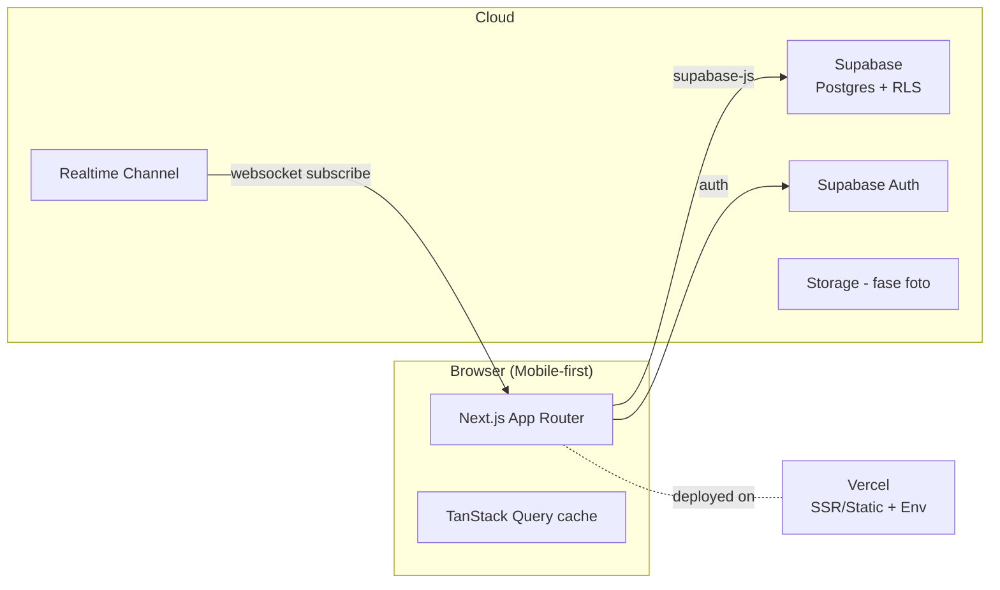
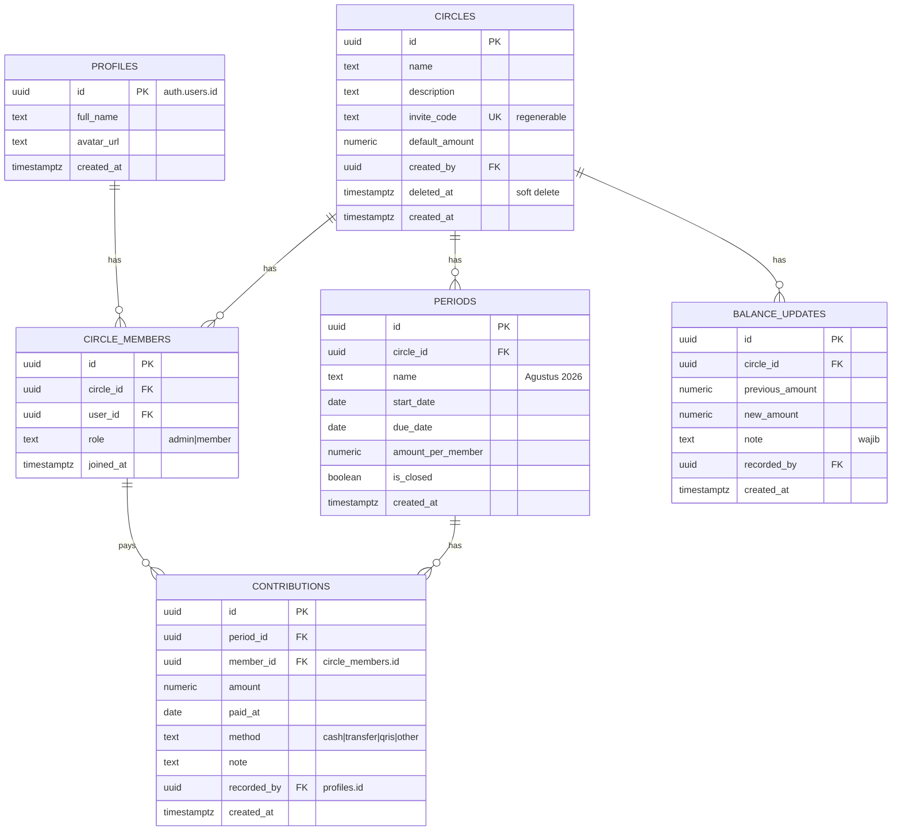

# Architecture — Teadrop

## 1. Tech Stack

| Layer | Teknologi |
|---|---|
| Framework | Next.js 15 (App Router, src dir) + React 19 |
| Bahasa | TypeScript |
| Styling | Tailwind CSS v4 + shadcn/ui |
| Data fetching | TanStack Query v5 + supabase-js v2 |
| State klien | Zustand (UI state ringan) |
| Database/Auth/Realtime | Supabase (Postgres, GoTrue, Realtime) |
| Validasi | Zod |
| Hosting | Vercel (web) + Supabase cloud (data) |

## 2. Diagram Arsitektur



## 3. Entity Relationship Diagram



## 4. Keputusan Desain Penting

| # | Keputusan | Alasan |
|---|---|---|
| D1 | Saldo RDPU/rekening **manual** dengan audit trail immutable | API publik NAB tidak resmi & rawan berubah; manual lebih andal |
| D2 | `contributions.member_id` menunjuk `circle_members` (bukan profiles) | Menjaga integritas keanggotaan; jika keluar circle, riwayat tetap utuh |
| D3 | Soft delete untuk circle | Mencegah hilangnya riwayat finansial karena salah klik |
| D4 | RLS berbasis fungsi `is_circle_member(circle_id)` | Satu policy reusable, mudah diaudit |
| D5 | Realtime via channel per-circle (`circle:<id>`) | Hemat bandwidth, hanya data circle aktif |

## 5. Struktur Folder

```
src/
├── app/                    # routes (App Router)
│   ├── (auth)/login/
│   ├── (app)/
│   │   ├── circles/[id]/   # dashboard circle (realtime)
│   │   │   ├── members/
│   │   │   ├── periods/
│   │   │   └── history/
│   │   └── settings/
│   └── layout.tsx
├── components/ui/          # shadcn primitives
├── lib/
│   ├── supabase/           # client, server client, helpers
│   └── utils.ts
├── features/
│   ├── circles/            # hooks, queries, types
│   ├── contributions/
│   └── balance/
└── middleware.ts           # proteksi route auth
```

## 6. Flow Utama

### Join Circle
1. User login → input kode undangan.
2. RPC `join_circle(code)` validasi kode & cek sudah jadi anggota/belum.
3. Insert `circle_members(role='member')` → realtime memberitahu admin.

### Update Saldo Manual
1. Admin submit form (saldo baru + catatan).
2. Server membaca saldo terakhir → insert baris `balance_updates` baru.
3. Realtime broadcast → dashboard semua anggota ter-update otomatis.

## 7. Deployment

- **Vercel**: build `next build`; env `NEXT_PUBLIC_SUPABASE_URL`, `NEXT_PUBLIC_SUPABASE_ANON_KEY`.
- **Supabase**: migrasi SQL via `supabase/migrations/*.sql` (dijalankan lewat Supabase CLI / SQL editor).
- Branch `main` = production preview.
